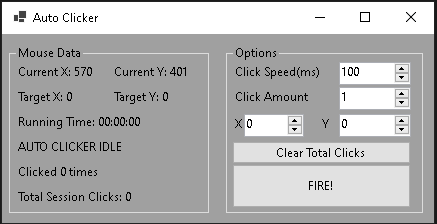

# AutoClicker
> Set the desired coordinates you want to be clicked and let the computer do it for you!

# ***Installation***
1. Download and unzip from [releases](https://github.com/BrandoTheDev/AutoClicker/releases/download/v2.0.0/AutoClicker.zip)
2. Move the entire folder to where you like
3. Double click AutoClicker.exe
4. Enjoy

# ***Options Explained***
> Click Speed is the time in milliseconds between clicks

> Click Amount is the total amount of clicks you want to happen

> X and Y are the coordinates the mouse will go to click

> Clear total clicks restarts the total counter

> FIRE! Starts the automation
