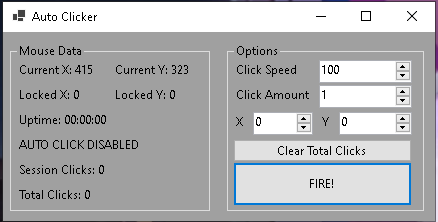

# AutoClicker
> Set the desired coordinates you want to be clicked and let the computer do it for you!

# ***Installation***
1. Download and unzip from releases
2. Move the entire folder to where you like
3. Double click AutoClicker.exe
4. Enjoy

# ***Options Explained***
> Click Speed is the time in milliseconds between clicks

> Click Amount is the total amount of clicks you want to happen

> X and Y are the coordinates the mouse will go to click

> Clear total clicks restarts the total counter

> FIRE! Starts the automation

# ***Roadmap***
> These are some future updates im planning
1. Rename all hardcoded controls
2. Lock form so it cant be resized
3. Change label text for clarity
4. Change tab priority on options
5. Maybe Add tooltips to options?

